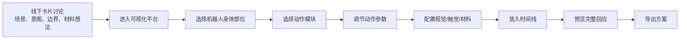

# 低代码机器人回应设计平台 PRD

## 1. 项目定位

本平台是 Gentle Robot 项目中的软件端 design probe / authoring tool，用于帮助参与者将线下共创讨论中形成的机器人回应想法，转化为可视化、可配置、可预览和可记录的 visual-tactile robot response 方案。

平台不承担完整的场景访谈、意图生成或 LLM 主持讨论功能。前置的情境讨论、照护目标界定、边界协商和材料想象主要通过实体卡片与材料包完成。软件平台从“动作设计”开始，重点支持参与者围绕一个统一机器人形态，对不同身体部位的动作、视觉表现、触觉反馈、材料属性和时间序列进行低颗粒度配置。

一句话定位：

> 一个面向老年照护场景的 visual-tactile robot response authoring and preview platform。

## 2. 平台边界

### 2.1 平台负责的内容

- 选择机器人身体部位。
- 选择该部位可执行的动作模块。
- 调节动作参数，例如速度、幅度、强度、节奏和持续时间。
- 配置视觉回应，例如灯光、颜色、亮度、表情和图标。
- 配置触觉回应，例如起伏、升温、轻震、软硬变化和材料覆盖。
- 将多个动作放入时间线，形成完整机器人回应流程。
- 预览机器人回应。
- 导出方案摘要，用于研究分析和后续设计迭代。
- 在后台记录匿名化的平台操作、参数调节、预览和方案编辑过程，用于 Study 2 的研究分析。

### 2.2 平台暂不负责的内容

- 不作为完整访谈系统。
- 不自动判断真实老人状态。
- 不直接承担医疗诊断、心理治疗或健康监测判断。
- 不在平台内完成复杂 LLM 对话引导。
- 不默认推荐“最正确”的机器人行为。
- 不允许用户配置高风险身体支撑、摔倒干预或医疗级参数。

## 3. 使用场景

平台用于 Study 2 中的设计活动。参与者通常包括一位老年人和一位专业照护者，或与照护相关的参与者组合。

研究流程中，参与者先使用实体卡片和 soft skin material kit 讨论某一照护情境，例如睡前安抚、情绪低落、远程陪伴、起夜提醒或日常提醒。随后进入软件平台，将讨论出的机器人回应想法转化为具体动作序列。

平台的研究作用不是验证某个机器人行为是否“最优”，而是帮助研究者观察：

- 参与者如何把照护意图转译为机器人身体动作。
- 哪些身体部位更适合承载视觉、触觉或动作反馈。
- 参与者如何调节速度、强度、节奏和持续时间。
- 参与者如何理解材料、触觉和机器人身体之间的关系。
- 参与者会在哪些地方提出舒适性、可接受性、安全、隐私和边界问题。

## 4. 核心用户

### 4.1 老年人

老年人作为被照护者，主要表达对机器人回应的感受、偏好、舒适性和边界。例如哪些动作让人安心，哪些动作会打扰、冒犯或造成不适。

### 4.2 照护者

照护者包括护工、家属或其他照护相关人员。他们主要关注机器人回应是否符合照护流程、是否便于理解、是否可能造成风险、是否需要人工确认或远程介入。

### 4.3 研究者

研究者使用平台收集参与者配置过程、方案结果和讨论内容，用于分析 robot response solution space，并进一步优化 interaction framework。

## 5. 核心流程

平台打开后的第一屏就是可视化机器人编排界面。参与者不需要先填写长表单，也不需要先完成动作推荐步骤。

## 6. 信息架构

### 6.1 中央机器人可视化画布

中央区域显示统一机器人模型。用户可以直接点击机器人身体部位进行配置。

支持部位：

- 头部
- 脸部
- 手部
- 胸部
- 腹部
- 全身/轮子

画布需要支持：

- 选中部位高亮。
- 局部动作预览。
- 视角切换，例如正面、侧面、俯视。
- 播放完整时间线。

### 6.2 左侧身体部位与动作库

左侧上方显示身体部位列表。用户选择某个部位后，下方显示该部位可用动作模块。

动作库不做“推荐 / 可选 / 谨慎”分栏，而是按身体部位组织。每个动作卡片显示：

- 动作名称。
- 对应部位。
- 回应类型，例如动作、灯光、触觉、材料。
- 简短描述。
- 是否涉及安全或舒适性提醒。

### 6.3 右侧参数配置面板

右侧显示当前选中动作的参数。不同动作显示不同参数，但保持统一结构：

- 基础参数：持续时间、速度、强度。
- 运动参数：方向、幅度、角度、节奏。
- 视觉参数：颜色、亮度、渐变方式、循环次数。
- 触觉参数：起伏幅度、温度档位、震动强度、软硬程度。
- 安全参数：是否需要确认、是否允许自动触发、是否可由用户停止。

### 6.4 底部时间线

底部时间线用于编排多个动作。用户可以将动作模块拖入时间线，并调整动作顺序、持续时间和重叠关系。

时间线需要支持：

- 添加动作。
- 拖拽排序。
- 调整动作时长。
- 查看动作开始和结束时间。
- 播放局部片段。
- 播放完整回应。

### 6.5 材料与触觉配置

当动作涉及触觉或身体表面变化时，平台提供材料配置入口。

材料信息包括：

- 材料名称，例如 faux fur、silicone、cotton、foam、silk。
- 生活化触感描述，例如毛绒、柔软、弹性、光滑、温暖、包覆。
- 适合部位。
- 适合动作。
- 可能风险或注意事项。
- 与实体材料包的编号对应。

## 7. 研究日志与方案记录模块

平台需要在后台记录参与者的操作轨迹，作为 Study 2 的 interaction trace。该模块不作为主要用户界面展示，不用于实时推荐，也不用于自动判断参与者偏好。它的作用是补充访谈、观察笔记和最终方案数据，帮助研究者理解参与者如何一步步构建 visual-tactile robot response。

日志只记录匿名化的平台操作，不记录真实姓名、健康诊断、原始语音或其他可识别个人身份的信息。

### 7.1 选择行为日志

记录参与者在平台中选择了什么，包括：

- 选择的机器人身体部位。
- 添加的动作模块。
- 选择的材料。
- 加入时间线的动作。
- 从时间线删除的动作。
- 启用或关闭的确认、停止和边界控制选项。

这类数据用于分析不同场景和意图下，参与者倾向使用哪些身体部位、动作类型和材料组合。

### 7.2 参数调节日志

记录参与者如何调整动作和触觉参数，包括：

- 速度变化。
- 强度变化。
- 持续时间变化。
- 灯光颜色和亮度变化。
- 节奏、循环次数和时间间隔变化。
- 温度、震动、起伏幅度和软硬程度变化。

这类数据用于分析参与者如何把“安抚”“陪伴”“提醒”“确认”等意图转译为更具体的速度、强度、节奏和持续时间。

### 7.3 编辑过程日志

记录参与者如何反复修改方案，包括：

- 预览次数。
- 被反复修改的动作。
- 添加后又删除的动作。
- 时间线顺序调整。
- 是否查看或触发安全提示。
- 是否使用停止或确认机制。

这类数据用于分析设计过程中的犹豫点、冲突点和边界协商。例如，某个动作被多次预览后删除，可能提示该动作在舒适性或边界感上存在争议。

### 7.4 最小日志字段

第一版平台建议至少记录以下字段：

| 字段 | 含义 |
|---|---|
| `session_id` | 匿名研究场次编号 |
| `timestamp` | 操作发生时间 |
| `participant_role` | 操作者角色，例如 older adult、caregiver 或 researcher |
| `event_type` | 操作类型，例如 select_part、add_action、adjust_parameter、preview、delete_action |
| `target_part` | 操作涉及的身体部位 |
| `action_id` | 操作涉及的动作模块 |
| `parameter_name` | 被调节的参数名称 |
| `old_value` | 参数变化前的值 |
| `new_value` | 参数变化后的值 |
| `timeline_position` | 动作在时间线中的位置 |
| `material_id` | 被选择或调整的材料编号 |
| `preview_count` | 当前方案累计预览次数 |
| `note` | 可选研究备注 |

第一版只需要支持 CSV 或 JSON 导出，不需要搭建完整数据看板。

## 8. 动作模块设计

### 8.1 头部

可设计动作：

- 点头
- 摇头
- 抬头
- 低头
- 转向用户
- 轻微左右转动

主要参数：

- 角度
- 速度
- 次数
- 停留时间
- 是否循环

可能支持的表达：

- 确认
- 拒绝
- 注意
- 安抚
- 疑问

### 8.2 脸部

可设计回应：

- 微笑
- 闭眼
- 眨眼
- 疑问表情
- 提醒图标
- 简短文字

主要参数：

- 表情类型
- 显示时长
- 亮度
- 是否与动作同步

可能支持的表达：

- 陪伴
- 反馈
- 状态确认
- 提醒

### 8.3 手部

这里暂时将手臂和手端作为一个整体模块处理，不再细分。

可设计动作：

- 单侧抬起
- 双侧抬起
- 小幅上下摆动
- 收回
- 环抱姿态
- 手端发光
- 手端震动
- 手端升温
- 触摸确认

主要参数：

- 抬起高度
- 速度
- 停留时间
- 摆动幅度
- 震动强度
- 温度档位

可能支持的表达：

- 问候
- 邀请
- 安抚
- 确认
- 远程连接

### 8.4 胸部

可设计回应：

- 心形灯
- 柔光渐亮/渐暗
- 呼吸灯
- 心跳灯
- 颜色变化

主要参数：

- 颜色
- 起始亮度
- 目标亮度
- 变化时长
- 呼吸周期
- 心跳节奏
- 循环次数

可能支持的表达：

- 陪伴
- 安抚
- 提醒
- 远程情感表达

### 8.5 腹部

可设计回应：

- 呼吸式起伏
- 局部膨胀回弹
- 软硬变化
- 局部升温
- 轻震

主要参数：

- 起伏幅度
- 起伏速度
- 循环次数
- 温度档位
- 震动强度
- 软硬程度
- 持续时间

可能支持的表达：

- 安抚
- 呼吸引导
- 身体陪伴
- 触觉反馈

### 8.6 全身/轮子

可设计动作：

- 原地转向
- 短距离靠近
- 后退
- 原地等待
- 停止

主要参数：

- 移动距离
- 移动速度
- 转向角度
- 停留时间
- 与用户距离

可能支持的表达：

- 主动介入
- 退出
- 陪伴
- 边界控制

## 9. 参数设计原则

平台参数应保持低颗粒度，避免让参与者像专业工程师一样配置复杂程序。默认展示基础参数，高级参数可折叠。

基础参数包括：

- 持续时间
- 速度
- 强度
- 幅度
- 节奏
- 颜色
- 是否循环

高级参数包括：

- 曲线类型
- 起始值和目标值
- 多动作同步
- 延迟时间
- 重复次数
- 安全确认条件

参数命名应尽量生活化。例如优先使用“慢 / 中 / 快”“轻 / 中 / 强”“短 / 中 / 长”，同时在后台保留可量化数值，便于研究记录和后续实现。

## 10. 安全与边界

平台需要明确区分“可由参与者自由配置的表达参数”和“需要专家确定的安全参数”。

参与者可配置：

- 灯光颜色和亮度。
- 动作速度和幅度。
- 触觉强度档位。
- 时间线顺序。
- 是否需要老人确认。
- 是否允许一键停止。

需要限制或专家确认：

- 支撑身体、扶站、防跌倒等物理辅助动作。
- 医疗监测阈值。
- 生理状态判断。
- 长时间自动介入。
- 强接触、强震动或突然靠近。

平台中应提供边界提示，但不要以医疗或安全结论的形式呈现。

### 10.1 研究伦理与日志边界

研究日志应遵循匿名化和最小化记录原则：

- 使用匿名 `session_id` 区分研究场次。
- 不记录参与者姓名、联系方式、健康诊断、原始语音或可识别个人信息。
- 不把操作日志单独解释为参与者动机或偏好，需要结合访谈、观察笔记和最终设计方案进行分析。
- 日志用于 Study 2 的研究分析，不用于实时推荐、自动评价或自动判断用户偏好。

## 11. 输出内容

平台最终导出的方案应包括：

- 方案名称。
- 使用场景。
- 主要回应意图。
- 使用身体部位。
- 动作模块列表。
- 参数设置。
- 材料选择。
- 时间线顺序。
- 预览截图或流程图。
- 参与者备注。
- 安全与边界提醒。

平台导出应包含两类数据：

1. 最终方案数据：最终选择的身体部位、动作模块、参数、材料和时间线顺序。
2. 过程日志数据：匿名化 interaction trace，用于和访谈、观察笔记交叉分析。

导出内容用于研究分析，而不是直接作为可部署机器人程序。

## 12. 研究贡献定位

该平台的贡献不在于构建一个通用机器人编程环境，而在于提供一个面向照护情境的 visual-tactile response design toolkit。

它帮助研究者探索：

- 老年人与照护者如何理解机器人身体部位的表达潜力。
- 不同 visual-tactile action modules 如何被组合成照护回应。
- 参与者如何在安抚、陪伴、提醒、确认和退出之间做权衡。
- 材料、触觉和动作如何共同影响舒适性与可接受性。
- 哪些参数需要开放给用户，哪些参数应由专家或系统限制。

## 13. MVP 范围

第一版平台应优先实现：

- 统一机器人可视化界面。
- 身体部位选择。
- 每个部位的基础动作库。
- 右侧参数面板。
- 底部动作时间线。
- 简单预览。
- 方案导出。
- 匿名化操作日志记录。
- CSV 或 JSON 日志导出。

第一版暂不实现：

- 自动动作推荐。
- 完整 LLM 访谈。
- 真实传感器接入。
- 真实机器人控制。
- 医疗级安全判断。
- 复杂多人协同编辑。
- 完整数据分析看板。

## 14. 后续可扩展方向

后续版本可以考虑：

- 根据线下 brief 对动作进行排序。
- 加入简单的适配度和风险提示。
- 支持更多材料属性可视化。
- 支持专家模式参数。
- 支持多版本方案比较。
- 支持研究数据自动整理。
- 与真实机器人控制接口连接。
